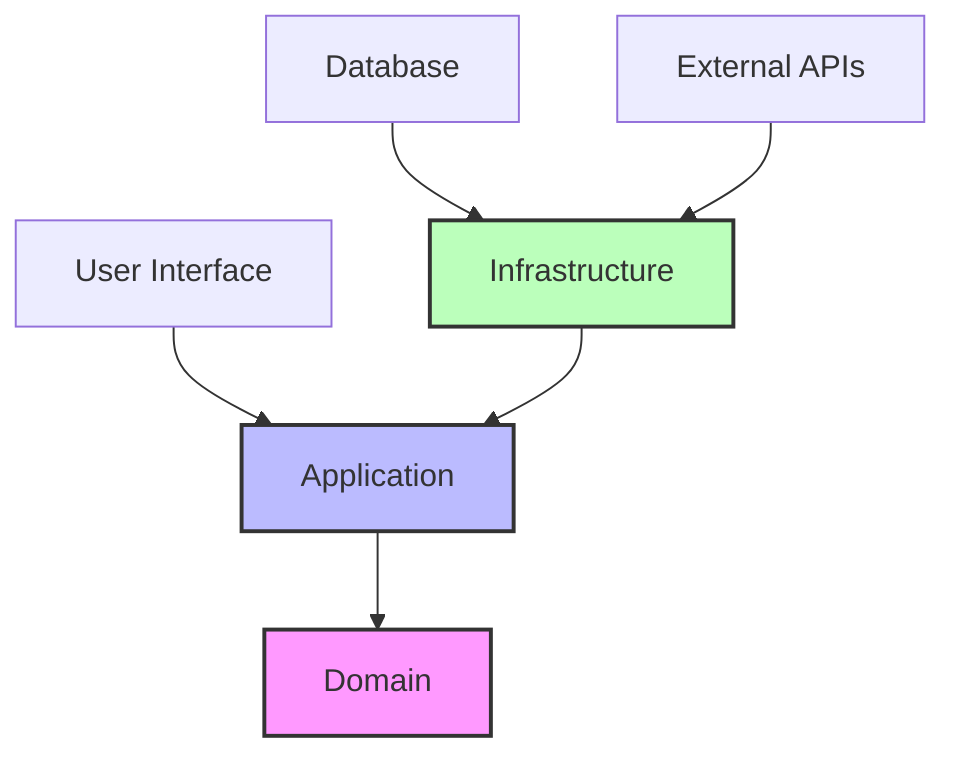

# NestJS 헥사고날 아키텍처 구현 가이드

> **참조**: [Sairyss/domain-driven-hexagon](https://github.com/Sairyss/domain-driven-hexagon) 기반 실무 적용 가이드

## 📋 목차
1. [헥사고날 아키텍처 개요](#헥사고날-아키텍처-개요)
2. [아키텍처 원칙과 패턴](#아키텍처-원칙과-패턴)
3. [디렉토리 구조 설계](#디렉토리-구조-설계)
4. [레이어별 구현 가이드](#레이어별-구현-가이드)
5. [실제 코드 구현 예제](#실제-코드-구현-예제)
6. [테스트 전략](#테스트-전략)
7. [리팩토링 가이드](#리팩토링-가이드)
8. [모범 사례 및 주의사항](#모범-사례-및-주의사항)

---

## 🏗️ 헥사고날 아키텍처 개요

### 핵심 개념
헥사고날 아키텍처(Ports and Adapters)는 **비즈니스 로직을 중심으로 하는 아키텍처 패턴**입니다.

```
외부 세계 → [Adapters] → [Ports] → [Application Core] → [Domain]
```

#### 주요 원칙
1. **의존성 역전**: 외부 레이어가 내부 레이어를 의존
2. **관심사 분리**: 비즈니스 로직과 인프라스트럭처 분리  
3. **테스트 용이성**: 외부 의존성을 모킹하여 독립적 테스트
4. **유연성**: 외부 시스템 변경에 도메인 로직 영향 최소화

### 아키텍처 레이어 구조



#### 1. Domain Layer (핵심)
- **Entities**: 비즈니스 식별자를 가진 핵심 객체
- **Value Objects**: 불변 값 객체
- **Aggregates**: 일관성 경계를 가진 객체 집합
- **Domain Services**: 도메인 로직 처리
- **Domain Events**: 도메인 내 중요한 사건

#### 2. Application Layer (유스케이스)
- **Application Services**: 애플리케이션 워크플로우 조정
- **Commands/Queries**: CQRS 패턴 구현
- **Ports**: 외부 시스템과의 인터페이스 정의
- **Event Handlers**: 도메인 이벤트 처리

#### 3. Infrastructure Layer (외부 연동)
- **Adapters**: 포트 인터페이스 구현
- **Repositories**: 데이터 영속성 처리
- **External Services**: 외부 API 연동
- **Configurations**: 설정 관리

---

## ⚡ 아키텍처 원칙과 패턴

### SOLID 원칙 적용

#### Single Responsibility Principle
```typescript
// ❌ 나쁜 예: 여러 책임을 가진 서비스
export class UserService {
  async createUser() { /* 사용자 생성 */ }
  async sendEmail() { /* 이메일 전송 */ }
  async validateUser() { /* 사용자 검증 */ }
}

// ✅ 좋은 예: 단일 책임 분리
export class CreateUserUseCase { /* 사용자 생성만 담당 */ }
export class EmailService { /* 이메일 전송만 담당 */ }
export class UserValidator { /* 사용자 검증만 담당 */ }
```

#### Dependency Inversion Principle
```typescript
// ✅ 포트(인터페이스) 정의
export interface UserRepositoryPort {
  save(user: UserEntity): Promise<void>;
  findById(id: UserId): Promise<UserEntity>;
}

// ✅ 애플리케이션 서비스는 포트에 의존
export class CreateUserUseCase {
  constructor(
    @Inject('UserRepository')
    private readonly userRepo: UserRepositoryPort
  ) {}
}

// ✅ 인프라스트럭처는 포트를 구현
export class TypeOrmUserRepository implements UserRepositoryPort {
  // 구체적인 구현
}
```

### 핵심 패턴

#### 1. Ports and Adapters Pattern
```typescript
// Port (인터페이스)
export interface PaymentServicePort {
  processPayment(amount: Money): Promise<PaymentResult>;
}

// Adapter (구현체)
export class StripePaymentAdapter implements PaymentServicePort {
  async processPayment(amount: Money): Promise<PaymentResult> {
    // Stripe API 호출
  }
}
```

#### 2. Repository Pattern
```typescript
// 도메인 중심 리포지토리
export interface UserRepositoryPort {
  // 도메인 언어 사용
  findActiveUsers(): Promise<UserEntity[]>;
  findByEmail(email: Email): Promise<UserEntity>;
  
  // 집계 루트만 저장
  save(user: UserEntity): Promise<void>;
}
```

#### 3. Domain Events Pattern
```typescript
// 도메인 이벤트
export class UserCreatedDomainEvent extends DomainEvent {
  constructor(public readonly userId: string) {
    super();
  }
}

// 엔터티에서 이벤트 발행
export class UserEntity extends AggregateRoot {
  static create(props: CreateUserProps): UserEntity {
    const user = new UserEntity(props);
    
    // 도메인 이벤트 등록
    user.addEvent(new UserCreatedDomainEvent(user.id));
    return user;
  }
}
```

#### 4. Command Query Separation (CQS)
```typescript
// Command (상태 변경, 반환값 없음)
export class CreateUserCommand {
  constructor(
    public readonly email: string,
    public readonly name: string,
  ) {}
}

// Query (상태 조회, 부작용 없음)  
export class FindUserQuery {
  constructor(public readonly userId: string) {}
}
```

---

## 📁 디렉토리 구조 설계

### Sairyss 패턴 기반 권장 구조
```
src/
├── modules/                    # 비즈니스 모듈 (Vertical Slices)
│   ├── user/
│   │   ├── commands/           # Command handlers
│   │   │   ├── create-user/
│   │   │   │   ├── create-user.command.ts
│   │   │   │   ├── create-user.service.ts
│   │   │   │   ├── create-user.controller.ts
│   │   │   │   └── create-user.request.dto.ts
│   │   │   └── update-user/
│   │   ├── queries/            # Query handlers
│   │   │   ├── find-users/
│   │   │   └── get-user-profile/
│   │   ├── domain/             # 도메인 레이어
│   │   │   ├── user.entity.ts
│   │   │   ├── user.errors.ts
│   │   │   ├── events/
│   │   │   └── value-objects/
│   │   ├── database/           # 영속성 레이어
│   │   │   ├── user.repository.port.ts
│   │   │   ├── user.repository.ts
│   │   │   └── user.orm-entity.ts
│   │   ├── user.mapper.ts      # 데이터 변환
│   │   └── user.module.ts
│   │
│   ├── order/                  # 다른 비즈니스 모듈
│   └── product/
│
├── libs/                       # 공통 라이브러리
│   ├── ddd/                    # DDD 기본 클래스들
│   │   ├── aggregate-root.ts
│   │   ├── value-object.ts
│   │   ├── domain-event.ts
│   │   └── entity.base.ts
│   ├── exceptions/             # 공통 예외
│   └── decorators/             # 공통 데코레이터
│
├── config/                     # 설정 관련
└── main.ts
```

### 현재 프로젝트와의 매핑
현재 프로젝트는 이미 헥사고날 패턴이 부분적으로 적용되어 있습니다:

**현재 구조:**
```
src/
├── users/
│   ├── adapters/         → HTTP Controllers, Guards
│   ├── application/      → Use Cases, DTOs, Ports
│   └── domain/          → Entities, Value Objects, Events
├── auth/
└── infrastructure/      → Repositories, External Services
```

**권장 개선 사항:**
1. **Command/Query 분리** 도입
2. **Vertical Slicing** 적용 (기능별 폴더 구성)
3. **공통 DDD 라이브러리** 구성

---

## 🏗️ 레이어별 구현 가이드

### 공통 DDD 라이브러리 구성

먼저 Sairyss 패턴에 따른 공통 라이브러리를 구성합니다:

#### libs/ddd/aggregate-root.ts
```typescript
import { DomainEvent } from './domain-event';

export abstract class AggregateRoot<Props> {
  private _domainEvents: DomainEvent[] = [];
  
  protected constructor(
    protected readonly props: Props,
    protected readonly _id: string,
  ) {}

  get id(): string {
    return this._id;
  }

  protected addEvent(domainEvent: DomainEvent): void {
    this._domainEvents.push(domainEvent);
  }

  public getUncommittedEvents(): DomainEvent[] {
    return this._domainEvents;
  }

  public markEventsAsCommitted(): void {
    this._domainEvents = [];
  }

  protected abstract validate(): void;

  public getProps(): Props {
    const propsCopy = JSON.parse(JSON.stringify(this.props));
    return propsCopy;
  }
}
```

#### libs/ddd/value-object.ts  
```typescript
import { shallowEqual } from 'shallow-equal-object';

export abstract class ValueObject<T> {
  protected readonly props: T;

  constructor(props: T) {
    this.checkIfEmpty(props);
    this.validate(props);
    this.props = Object.freeze(props);
  }

  protected abstract validate(props: T): void;

  private checkIfEmpty(props: T): void {
    if (props === null || props === undefined) {
      throw new Error('Property cannot be null or undefined');
    }
  }

  equals(vo?: ValueObject<T>): boolean {
    if (vo === null || vo === undefined) {
      return false;
    }
    return shallowEqual(this.props, vo.props);
  }
}
```

#### libs/ddd/domain-event.ts
```typescript
export abstract class DomainEvent {
  public readonly occurredOn: Date;
  public readonly id: string;

  constructor() {
    this.id = randomUUID();
    this.occurredOn = new Date();
  }
}
```

### 1. Domain Layer 구현

#### Domain Entity 패턴
**Before (기존 TypeORM Entity):**
```typescript
// user.entity.ts
@Entity()
export class User {
  @PrimaryGeneratedColumn('uuid')
  id: string;

  @Column()
  email: string;

  @Column()
  name: string;

  @CreateDateColumn()
  createdAt: Date;
}
```

**After (Domain Entity):**
```typescript
// domain/user.entity.ts
import { AggregateRoot } from '@libs/ddd';
import { UserCreatedDomainEvent } from './events/user-created.domain-event';
import { Email } from './value-objects/email.value-object';
import { UserId } from './value-objects/user-id.value-object';

export interface CreateUserProps {
  email: Email;
  name: string;
}

export interface UserProps extends CreateUserProps {
  id: UserId;
  createdAt: Date;
  updatedAt: Date;
}

export class UserEntity extends AggregateRoot<UserProps> {
  protected readonly _id: UserId;

  static create(create: CreateUserProps): UserEntity {
    const id = UserId.generate();
    const props: UserProps = {
      ...create,
      id,
      createdAt: new Date(),
      updatedAt: new Date(),
    };
    
    const user = new UserEntity({ id, props });
    
    // 도메인 이벤트 발행
    user.addEvent(
      new UserCreatedDomainEvent({
        aggregateId: id.value,
        userId: id.value,
        email: create.email.value,
      })
    );
    
    return user;
  }

  get email(): Email {
    return this.props.email;
  }

  get name(): string {
    return this.props.name;
  }

  updateName(newName: string): void {
    this.props.name = newName;
    this.props.updatedAt = new Date();
  }

  // 비즈니스 로직 예시
  canCreateOrder(): boolean {
    // 사용자가 주문을 생성할 수 있는 조건 검증
    return this.email.isVerified && this.name.length > 0;
  }

  protected validate(): void {
    // 도메인 불변성 검증
    if (!this.props.email) {
      throw new Error('User email is required');
    }
    if (!this.props.name || this.props.name.length < 2) {
      throw new Error('User name must be at least 2 characters');
    }
  }
}
```

#### Value Objects 도입
```typescript
// domain/value-objects/email.value-object.ts
import { ValueObject } from '@libs/ddd';
import { Guard } from '@libs/guard';

interface EmailProps {
  value: string;
}

export class Email extends ValueObject<EmailProps> {
  static create(email: string): Email {
    Guard.againstNullOrUndefined(email, 'email');
    Guard.againstInvalidEmail(email);
    
    return new Email({ value: email.toLowerCase().trim() });
  }

  get value(): string {
    return this.props.value;
  }

  get isVerified(): boolean {
    // 이메일 검증 로직
    return true; // 구현 필요
  }

  protected validate(props: EmailProps): void {
    if (!props.value.includes('@')) {
      throw new Error('Invalid email format');
    }
  }
}
```

#### 도메인 이벤트
```typescript
// domain/events/user-created.domain-event.ts
import { DomainEvent, DomainEventProps } from '@libs/ddd';

export class UserCreatedDomainEvent extends DomainEvent {
  readonly userId: string;
  readonly email: string;

  constructor(props: DomainEventProps<UserCreatedDomainEvent>) {
    super(props);
    this.userId = props.userId;
    this.email = props.email;
  }
}
```

### 2. Application Layer 리팩토링

#### Command/Query 분리
**Command:**
```typescript
// commands/create-user/create-user.command.ts
import { Command, CommandProps } from '@libs/ddd';

export class CreateUserCommand extends Command {
  readonly email: string;
  readonly name: string;

  constructor(props: CommandProps<CreateUserCommand>) {
    super(props);
    this.email = props.email;
    this.name = props.name;
  }
}
```

**Command Handler:**
```typescript
// commands/create-user/create-user.service.ts
import { CommandHandler, ICommandHandler } from '@nestjs/cqrs';
import { Inject } from '@nestjs/common';
import { Result, Ok, Err } from 'oxide.ts';
import { CreateUserCommand } from './create-user.command';
import { UserEntity } from '../../domain/user.entity';
import { Email } from '../../domain/value-objects/email.value-object';
import { UserRepositoryPort } from '../../database/user.repository.port';
import { USER_REPOSITORY } from '../../user.tokens';

@CommandHandler(CreateUserCommand)
export class CreateUserService implements ICommandHandler {
  constructor(
    @Inject(USER_REPOSITORY)
    private readonly userRepo: UserRepositoryPort,
  ) {}

  async execute(command: CreateUserCommand): Promise<Result<string, Error>> {
    try {
      const email = Email.create(command.email);
      
      // 중복 이메일 검증
      const existingUser = await this.userRepo.findByEmail(email);
      if (existingUser) {
        return Err(new Error('User with this email already exists'));
      }

      // 도메인 객체 생성
      const user = UserEntity.create({
        email,
        name: command.name,
      });

      // 저장
      await this.userRepo.save(user);

      return Ok(user.id.value);
    } catch (error) {
      return Err(error);
    }
  }
}
```

**Query Handler:**
```typescript
// queries/find-users/find-users.query-handler.ts
import { IQueryHandler, QueryHandler } from '@nestjs/cqrs';
import { FindUsersQuery } from './find-users.query';

@QueryHandler(FindUsersQuery)
export class FindUsersQueryHandler implements IQueryHandler {
  constructor(
    @Inject(USER_REPOSITORY)
    private readonly userRepo: UserRepositoryPort,
  ) {}

  async execute(query: FindUsersQuery): Promise<UserResponseDto[]> {
    // 쿼리에서는 도메인을 거치지 않고 직접 DB 조회 가능
    const users = await this.userRepo.findMany(query);
    return users.map(user => new UserResponseDto(user));
  }
}
```

### 3. Infrastructure Layer 리팩토링

#### Repository 포트 정의
```typescript
// database/user.repository.port.ts
import { RepositoryPort } from '@libs/ddd';
import { UserEntity } from '../domain/user.entity';
import { Email } from '../domain/value-objects/email.value-object';
import { UserId } from '../domain/value-objects/user-id.value-object';

export interface UserRepositoryPort extends RepositoryPort<UserEntity> {
  findByEmail(email: Email): Promise<UserEntity | null>;
  findById(id: UserId): Promise<UserEntity | null>;
  existsByEmail(email: Email): Promise<boolean>;
}
```

#### Repository 구현
```typescript
// database/user.repository.ts
import { Injectable } from '@nestjs/common';
import { InjectRepository } from '@nestjs/typeorm';
import { Repository } from 'typeorm';
import { UserRepositoryPort } from './user.repository.port';
import { UserEntity } from '../domain/user.entity';
import { UserOrmEntity } from './user.orm-entity';
import { UserMapper } from '../user.mapper';
import { Email } from '../domain/value-objects/email.value-object';
import { UserId } from '../domain/value-objects/user-id.value-object';

@Injectable()
export class UserRepository implements UserRepositoryPort {
  constructor(
    @InjectRepository(UserOrmEntity)
    private readonly userOrmRepo: Repository<UserOrmEntity>,
    private readonly mapper: UserMapper,
  ) {}

  async save(entity: UserEntity): Promise<void> {
    const ormEntity = this.mapper.toPersistence(entity);
    await this.userOrmRepo.save(ormEntity);
    
    // 도메인 이벤트 발행
    await entity.publishEvents();
  }

  async findByEmail(email: Email): Promise<UserEntity | null> {
    const ormEntity = await this.userOrmRepo.findOne({
      where: { email: email.value }
    });
    
    return ormEntity ? this.mapper.toDomain(ormEntity) : null;
  }

  async findById(id: UserId): Promise<UserEntity | null> {
    const ormEntity = await this.userOrmRepo.findOne({
      where: { id: id.value }
    });
    
    return ormEntity ? this.mapper.toDomain(ormEntity) : null;
  }

  async existsByEmail(email: Email): Promise<boolean> {
    const count = await this.userOrmRepo.count({
      where: { email: email.value }
    });
    return count > 0;
  }
}
```

#### 매퍼 구현
```typescript
// user.mapper.ts
import { Injectable } from '@nestjs/common';
import { UserEntity } from './domain/user.entity';
import { UserOrmEntity } from './database/user.orm-entity';
import { UserResponseDto } from './dtos/user.response.dto';
import { Email } from './domain/value-objects/email.value-object';
import { UserId } from './domain/value-objects/user-id.value-object';

@Injectable()
export class UserMapper {
  toDomain(ormEntity: UserOrmEntity): UserEntity {
    const entityProps = {
      id: new UserId(ormEntity.id),
      email: Email.create(ormEntity.email),
      name: ormEntity.name,
      createdAt: ormEntity.createdAt,
      updatedAt: ormEntity.updatedAt,
    };

    return new UserEntity({ id: entityProps.id, props: entityProps });
  }

  toPersistence(entity: UserEntity): UserOrmEntity {
    const ormEntity = new UserOrmEntity();
    ormEntity.id = entity.id.value;
    ormEntity.email = entity.email.value;
    ormEntity.name = entity.name;
    ormEntity.createdAt = entity.getProps().createdAt;
    ormEntity.updatedAt = entity.getProps().updatedAt;
    return ormEntity;
  }

  toResponse(entity: UserEntity): UserResponseDto {
    return new UserResponseDto({
      id: entity.id.value,
      email: entity.email.value,
      name: entity.name,
      createdAt: entity.getProps().createdAt.toISOString(),
    });
  }
}
```

---

## 🧪 실제 코드 변환 예제

### 기존 Service → Command Handler 변환

**Before:**
```typescript
@Injectable()
export class UserService {
  constructor(
    @InjectRepository(User)
    private userRepo: Repository<User>,
  ) {}

  async createUser(createUserDto: CreateUserDto): Promise<User> {
    const existingUser = await this.userRepo.findOne({
      where: { email: createUserDto.email }
    });
    
    if (existingUser) {
      throw new ConflictException('User already exists');
    }

    const user = this.userRepo.create(createUserDto);
    return this.userRepo.save(user);
  }
}
```

**After:**
```typescript
@CommandHandler(CreateUserCommand)
export class CreateUserService implements ICommandHandler {
  constructor(
    @Inject(USER_REPOSITORY)
    private readonly userRepo: UserRepositoryPort,
  ) {}

  async execute(command: CreateUserCommand): Promise<Result<string, UserAlreadyExistsError>> {
    const email = Email.create(command.email);
    
    const existingUser = await this.userRepo.findByEmail(email);
    if (existingUser) {
      return Err(new UserAlreadyExistsError(email.value));
    }

    const user = UserEntity.create({
      email,
      name: command.name,
    });

    await this.userRepo.save(user);
    return Ok(user.id.value);
  }
}
```

### Controller 리팩토링

**Before:**
```typescript
@Controller('users')
export class UserController {
  constructor(private readonly userService: UserService) {}

  @Post()
  async createUser(@Body() dto: CreateUserDto) {
    return this.userService.createUser(dto);
  }
}
```

**After:**
```typescript
@Controller('users')
export class UserHttpController {
  constructor(private readonly commandBus: CommandBus) {}

  @Post()
  async createUser(
    @Body() request: CreateUserRequestDto
  ): Promise<IdResponse> {
    const command = new CreateUserCommand({
      email: request.email,
      name: request.name,
    });

    const result = await this.commandBus.execute(command);
    
    return match(result, {
      Ok: (id: string) => new IdResponse(id),
      Err: (error: Error) => {
        if (error instanceof UserAlreadyExistsError) {
          throw new ConflictException(error.message);
        }
        throw new InternalServerErrorException();
      },
    });
  }
}
```

---

## 🧪 테스트 전략

### 테스트 피라미드 in 헥사고날 아키텍처

```
      🔺 E2E Tests (Few)
    -----
   🔺 Integration Tests (Some)  
  --------  
 🔺 Unit Tests (Many)
```

#### 1. Unit Tests (Domain Layer)
도메인 로직은 외부 의존성 없이 테스트 가능해야 합니다.

```typescript
// domain/user.entity.spec.ts
describe('UserEntity', () => {
  describe('create', () => {
    it('should create user with valid data', () => {
      // Given
      const props = {
        email: Email.create('test@example.com'),
        name: 'Test User',
      };

      // When  
      const user = UserEntity.create(props);

      // Then
      expect(user.email.value).toBe('test@example.com');
      expect(user.name).toBe('Test User');
      expect(user.getUncommittedEvents()).toHaveLength(1);
      expect(user.getUncommittedEvents()[0]).toBeInstanceOf(UserCreatedEvent);
    });

    it('should throw error for invalid email', () => {
      // Given
      const props = {
        email: 'invalid-email',
        name: 'Test User',
      };

      // When & Then
      expect(() => Email.create(props.email)).toThrow('Invalid email format');
    });
  });

  describe('business rules', () => {
    it('should allow order creation for verified users', () => {
      // Given
      const user = UserEntity.create({
        email: Email.create('verified@example.com'),
        name: 'Verified User',
      });

      // When
      const canCreateOrder = user.canCreateOrder();

      // Then  
      expect(canCreateOrder).toBe(true);
    });
  });
});
```

#### 2. Application Layer Tests
```typescript
// commands/create-user/create-user.service.spec.ts
describe('CreateUserService', () => {
  let service: CreateUserService;
  let userRepo: MockProxy<UserRepositoryPort>;
  let eventBus: MockProxy<EventBus>;

  beforeEach(() => {
    userRepo = mock<UserRepositoryPort>();
    eventBus = mock<EventBus>();
    service = new CreateUserService(userRepo, eventBus);
  });

  describe('execute', () => {
    it('should create user successfully', async () => {
      // Given
      userRepo.existsByEmail.mockResolvedValue(false);
      userRepo.save.mockResolvedValue(undefined);

      const command = new CreateUserCommand({
        email: 'test@example.com',
        name: 'Test User',
      });

      // When
      const result = await service.execute(command);

      // Then
      expect(result.isOk()).toBe(true);
      expect(userRepo.save).toHaveBeenCalledWith(expect.any(UserEntity));
      expect(eventBus.publishAll).toHaveBeenCalledWith(expect.any(Array));
    });

    it('should return error when user already exists', async () => {
      // Given
      userRepo.existsByEmail.mockResolvedValue(true);

      const command = new CreateUserCommand({
        email: 'existing@example.com', 
        name: 'Test User',
      });

      // When
      const result = await service.execute(command);

      // Then
      expect(result.isErr()).toBe(true);
      expect(result.unwrapErr()).toBeInstanceOf(UserAlreadyExistsError);
      expect(userRepo.save).not.toHaveBeenCalled();
    });
  });
});
```

#### 3. Integration Tests  
```typescript
// user.integration.spec.ts
describe('User Module Integration', () => {
  let app: INestApplication;
  let commandBus: CommandBus;
  let userRepo: Repository<UserOrmEntity>;

  beforeEach(async () => {
    const moduleRef = await Test.createTestingModule({
      imports: [UserModule, TestDatabaseModule],
    }).compile();

    app = moduleRef.createNestApplication();
    commandBus = moduleRef.get(CommandBus);
    userRepo = moduleRef.get(getRepositoryToken(UserOrmEntity));
    await app.init();
  });

  it('should handle complete user creation workflow', async () => {
    // Given
    const command = new CreateUserCommand({
      email: 'integration@example.com',
      name: 'Integration Test User',
    });

    // When
    const result = await commandBus.execute(command);

    // Then
    expect(result.isOk()).toBe(true);
    
    const savedUser = await userRepo.findOne({
      where: { email: 'integration@example.com' }
    });
    expect(savedUser).toBeDefined();
    expect(savedUser?.name).toBe('Integration Test User');
  });
});
```

#### 4. Contract Tests (포트 검증)
```typescript
// contracts/user-repository.contract.ts
export const UserRepositoryContract = (
  getRepository: () => UserRepositoryPort
) => {
  describe('UserRepositoryPort Contract', () => {
    let userRepo: UserRepositoryPort;

    beforeEach(() => {
      userRepo = getRepository();
    });

    it('should save and find user by email', async () => {
      // Given
      const user = UserEntity.create({
        email: Email.create('contract@example.com'),
        name: 'Contract Test User',
      });

      // When
      await userRepo.save(user);
      const foundUser = await userRepo.findByEmail(user.email);

      // Then
      expect(foundUser).toBeDefined();
      expect(foundUser?.email.value).toBe('contract@example.com');
    });
  });
};
```

### 테스트 매처 및 헬퍼
```typescript
// test/helpers/domain-matchers.ts
export const domainMatchers = {
  toBeValueObject: (received: any, expected: any) => {
    const pass = received?.equals && received.equals(expected);
    return {
      pass,
      message: () => pass 
        ? `Expected ${received} not to equal value object ${expected}`
        : `Expected ${received} to equal value object ${expected}`,
    };
  },

  toHaveRaisedEvent: (received: AggregateRoot<any>, expectedEvent: any) => {
    const events = received.getUncommittedEvents();
    const hasEvent = events.some(event => event instanceof expectedEvent);
    return {
      pass: hasEvent,
      message: () => hasEvent
        ? `Expected aggregate not to have raised ${expectedEvent.name}`
        : `Expected aggregate to have raised ${expectedEvent.name}`,
    };
  },
};
```

---

## 🎯 모범 사례 및 주의사항

### ✅ 모범 사례

#### 1. **도메인 우선 설계**
```typescript
// ✅ 도메인 언어 사용
class User {
  assignToProject(project: Project): void {
    if (!this.isActive()) {
      throw new UserNotActiveError();
    }
    // 비즈니스 로직
  }
}

// ❌ 기술적 언어 사용
class User {
  updateProjectId(projectId: string): void {
    this.projectId = projectId;
  }
}
```

#### 2. **불변성 보장**
```typescript
// ✅ Value Object 불변성
export class Money extends ValueObject<{amount: number; currency: string}> {
  add(other: Money): Money {
    this.ensureSameCurrency(other);
    return new Money({
      amount: this.props.amount + other.props.amount,
      currency: this.props.currency,
    });
  }
}
```

#### 3. **명확한 경계 정의**
```typescript
// ✅ 집계 루트를 통한 접근
class Order extends AggregateRoot {
  addItem(product: Product, quantity: number): void {
    const item = OrderItem.create(product, quantity);
    this.items.push(item);
    this.calculateTotal();
  }
}

// ❌ 직접적인 접근
orderItem.setQuantity(5); // OrderItem을 직접 변경
```

#### 4. **의존성 역전 준수**
```typescript
// ✅ 포트를 통한 의존성 주입
class CreateUserUseCase {
  constructor(
    @Inject('UserRepository')
    private userRepo: UserRepositoryPort,
    @Inject('EmailService')  
    private emailService: EmailServicePort,
  ) {}
}
```

### ⚠️ 주의사항

#### 1. **과도한 추상화 지양**
```typescript
// ❌ 단순한 CRUD에 과도한 패턴 적용
class GetUserByIdUseCase {
  execute(id: string): Promise<User> {
    return this.userRepo.findById(id); // 단순한 조회에 불필요한 복잡성
  }
}

// ✅ 단순한 경우 Query Handler로 직접 처리
@QueryHandler(GetUserByIdQuery)
class GetUserByIdHandler {
  execute(query: GetUserByIdQuery) {
    return this.userRepo.findById(query.id);
  }
}
```

#### 2. **도메인 로직 유출 방지**
```typescript
// ❌ 컨트롤러에 비즈니스 로직
@Post('users/:id/activate')
async activateUser(@Param('id') id: string) {
  const user = await this.userRepo.findById(id);
  if (user.lastLoginDate > thirtyDaysAgo) { // 비즈니스 로직이 컨트롤러에
    user.status = 'ACTIVE';
  }
}

// ✅ 도메인에 비즈니스 로직
class User {
  activate(): void {
    if (!this.isEligibleForActivation()) { // 비즈니스 로직은 도메인에
      throw new UserNotEligibleError();
    }
    this.status = UserStatus.ACTIVE;
  }
}
```

#### 3. **성능 고려사항**
```typescript
// ❌ N+1 쿼리 문제
async getOrdersWithItems(userId: string): Promise<Order[]> {
  const orders = await this.orderRepo.findByUserId(userId);
  
  // 각 주문마다 별도 쿼리 실행
  for (const order of orders) {
    order.items = await this.orderItemRepo.findByOrderId(order.id);
  }
  return orders;
}

// ✅ 최적화된 쿼리
async getOrdersWithItems(userId: string): Promise<Order[]> {
  // 한 번의 쿼리로 모든 데이터 조회
  return this.orderRepo.findByUserIdWithItems(userId);
}
```

### 🔧 실무 적용 팁

#### 1. **점진적 마이그레이션**
- 새로운 기능은 헥사고날 패턴으로 구현
- 기존 코드는 버그 수정 시점에 리팩토링  
- 중요한 비즈니스 로직부터 우선 적용

#### 2. **팀 온보딩**
- 코드 리뷰 시 패턴 준수 확인
- 페어 프로그래밍을 통한 지식 공유
- 내부 기술 문서 및 예제 코드 작성

#### 3. **도구 활용**
- ESLint 규칙으로 아키텍처 경계 강제
- 아키텍처 테스트로 의존성 방향 검증
- 코드 생성 템플릿으로 일관성 유지

---

## 🔄 리팩토링 가이드

### 기존 프로젝트 마이그레이션 전략

#### Phase 1: 준비 단계 (1주)
1. **아키텍처 분석**
   - 현재 의존성 그래프 작성
   - 비즈니스 로직 위치 파악
   - 외부 시스템 연동점 식별

2. **공통 라이브러리 구성**
   - `libs/ddd` 모듈 생성
   - 기본 클래스들 구현
   - 공통 타입 정의

#### Phase 2: 도메인 레이어 구축 (2-3주)  
1. **핵심 도메인부터 시작**
   - 가장 중요한 비즈니스 로직 식별
   - Domain Entity로 변환
   - Value Objects 도입

2. **도메인 이벤트 구현**
   - 중요한 비즈니스 이벤트 식별
   - 이벤트 클래스 생성
   - 이벤트 발행 로직 추가

#### Phase 3: 애플리케이션 레이어 재구성 (2주)
1. **CQRS 패턴 적용**
   - Command/Query 클래스 생성
   - Handler 구현
   - CommandBus/QueryBus 설정

2. **포트 인터페이스 정의**
   - 외부 의존성 인터페이스 추출
   - 의존성 주입 설정 변경

#### Phase 4: 인프라스트럭처 분리 (1-2주)
1. **어댑터 구현**
   - Repository 어댑터
   - 외부 서비스 어댑터
   - 매퍼 클래스 구현

2. **설정 및 모듈 재구성**
   - NestJS 모듈 재구성
   - 의존성 주입 설정
   - 환경별 설정 분리

### 마이그레이션 체크리스트

#### ✅ Phase 완료 기준
**Phase 1:**
- [ ] 공통 DDD 라이브러리 구현 완료
- [ ] 현재 아키텍처 분석 문서 작성
- [ ] 마이그레이션 계획 수립

**Phase 2:**
- [ ] 핵심 도메인 엔터티 변환 완료
- [ ] Value Objects 구현
- [ ] 도메인 이벤트 적용
- [ ] 도메인 계층 단위 테스트 100%

**Phase 3:**
- [ ] CQRS 패턴 적용 완료
- [ ] 모든 포트 인터페이스 정의
- [ ] 애플리케이션 서비스 리팩토링
- [ ] 통합 테스트 작성

**Phase 4:**
- [ ] 모든 어댑터 구현 완료
- [ ] 의존성 주입 재설정
- [ ] E2E 테스트 통과
- [ ] 성능 테스트 통과

## 📚 참고 자료 및 도구

### 핵심 자료
- **[Sairyss/domain-driven-hexagon](https://github.com/Sairyss/domain-driven-hexagon)**: 본 가이드의 기반이 된 실무 중심 헥사고날 아키텍처 구현 예제
- **[NestJS CQRS](https://docs.nestjs.com/recipes/cqrs)**: NestJS 공식 CQRS 구현 가이드
- **[Domain-Driven Design](https://martinfowler.com/tags/domain%20driven%20design.html)**: Martin Fowler의 DDD 관련 아티클 모음
- **[Clean Architecture](https://blog.cleancoder.com/uncle-bob/2012/08/13/the-clean-architecture.html)**: Robert Martin의 클린 아키텍처 원칙

### 실용적 도구
- **[ArchUnit](https://www.archunit.org/)**: 아키텍처 규칙 자동 검증
- **[Madge](https://github.com/pahen/madge)**: 의존성 그래프 시각화
- **[dependency-cruiser](https://github.com/sverweij/dependency-cruiser)**: 의존성 규칙 검증
- **[ESLint boundaries](https://github.com/javierbrea/eslint-plugin-boundaries)**: 모듈 경계 강제

### NestJS 생태계
```bash
# 헥사고날 아키텍처 지원 패키지
npm install @nestjs/cqrs @nestjs/event-emitter
npm install class-validator class-transformer
npm install --save-dev @types/jest jest ts-jest supertest

# 도메인 모델링 지원
npm install zod               # 스키마 검증
npm install fp-ts             # 함수형 프로그래밍 유틸리티
npm install neverthrow        # Result/Error 타입
```

### 코드 생성 템플릿
```bash
# NestJS CLI로 헥사고날 구조 생성 예제
nest g module users
nest g service users/commands/create-user
nest g controller users/adapters/http/users.http
```

---